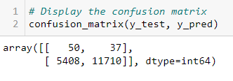
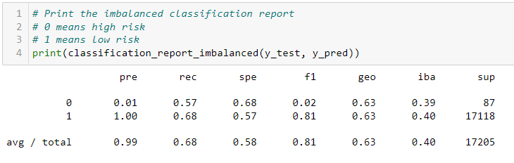
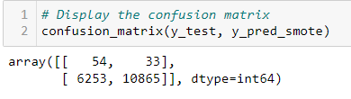
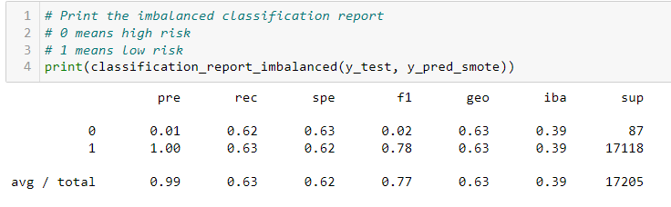
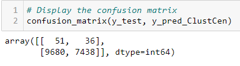
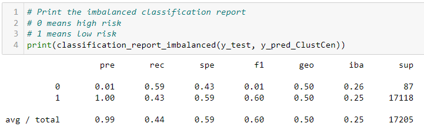
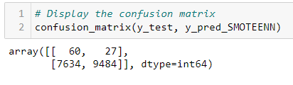

# Credit_Risk_Analysis

The goal of this project was for me to use various machine learning methods to predict credit card risk. The six methods are Naive Random Oversampling, SMOTE Oversampling, Undersampling with Cluster Centroids, SMOTEENN Over and Under Sampling Combination, Balanced Random Forest Classifier, and Easy Ensemble AdaBoost Classifier.

# Naive Random Oversampling

Naive Random Oversampling makes all classes represented by their decision function. Essentially this method of machine learning helps balance out the classes when there is an imbalance between data points by randomly selecting minority data points. The results of this method had a recall of 57% for high risk loans and only had an accuracy of 63%.

# SMOTE Oversampling

SMOTE Oversampling basically creates new data points for a minority class. The results of this method had a recall of 62% for high risk loans and only had an accuracy of 63%. Not much better than the previous method.

# Undersampling with Cluster Centroids

Undersampling with Cluster Centroids creates data points as well, but this time for the majority class. Once it does that, it undersamples the majority class to create balance with the minority class. The results of this method had a recall of 59% for high risk loans and only had an accuracy of 50%. The results using this method were especially bad.

# SMOTEENN Over and Undersampling Combination

SMOTEENN Over and Undersampling Combination is SMOTE but then data points are dropped. The data points that are dropped is determined by their proximity to other data points of different classes. The results of this method had a recall of 69% for high risk loans and only had an accuracy of 62%.

# Summary:

I was only able to get four of the six machine learning methods to work. I wasn't too impressed with any of the four that I used. The accuracy was pretty low for all of them. If I had to pick one of the four I would go with the SMOTEENN method. I think that method provides a better way of balancing out disproportion between majority and minority data classes.